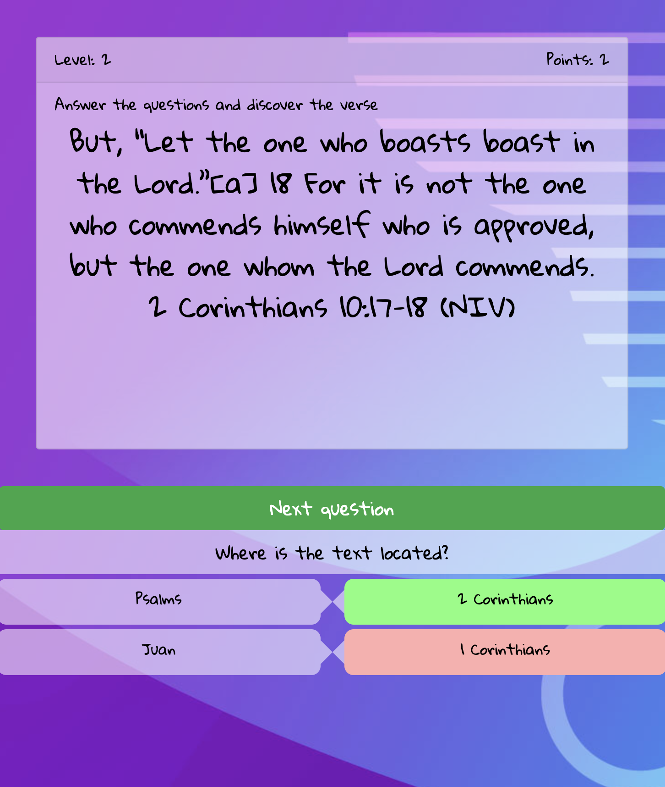

# Trivia Reveal The Verse

This is a pseudo game that shows the bible verse when you choose the right answer in the question.

This game was made to help teachers to teach a bible verse.

There is not points and there is not awards it just reveal the verse.

## Requirements to run it

- Browser

## Installations

Just clone the repository or download the code and open `index.html` in your favorite browser

## Configuration

In order to add your own questions and answers you can modify the data store, in this case it is just a file in JSON format.

The file is located in the root.

```text
🗂 trivia reveal the verse
  ├ 📁 assets
  ├ 📁 css
  ├ ⚙️ gitignore.js
  ├ 🎮 index.html
  ├ 🏳 language.js
  ├ 👮‍♀️ LICENSE
  ├ ⚙️ main.js
  ├ 💾 questions.json 👈 here are the questions and answers
  ├ 📑 readme.md

```

## Screen Shot



## Support

This is an open source project. It can grow thanks to the sponsors and support by the amazing backers.

## Status

Project is: _in progress_
Thank you for using this game

## Stay in touch

- Author - Luis Arias 2020 <ariassd@gmail.com> - [GitHub profile](https://github.com/ariassd)

## License

This software is licensed under [MIT License](LICENSE)

 

November 2020
